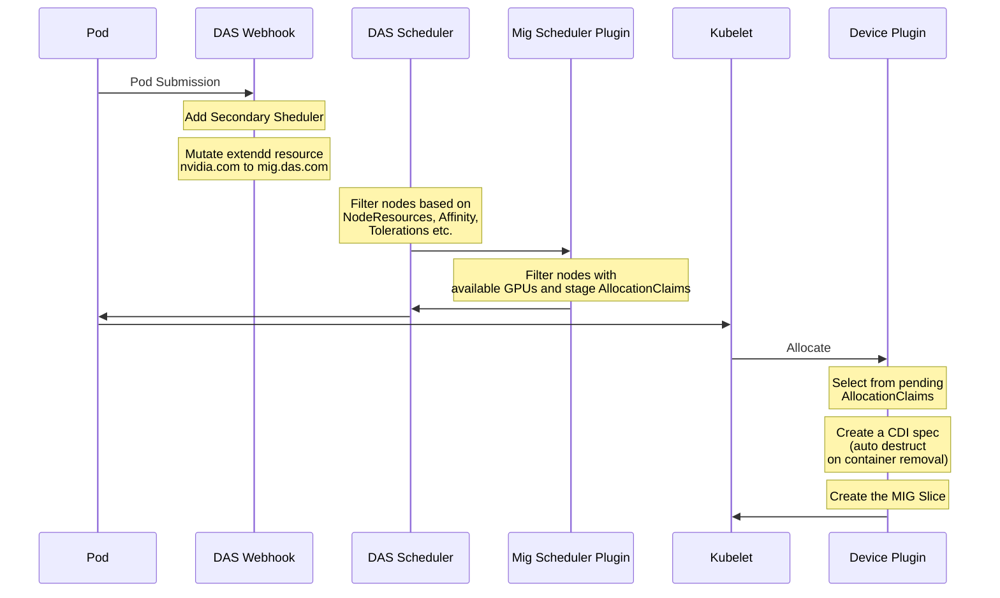

# Dynamic Accelerator Slicer (DAS) Operator

Dynamic Accelerator Slicer (DAS) provides on-demand partitioning of accelerators in Kubernetes clusters.
It currently includes a reference implementation for NVIDIA MIG but is designed to support other
partitioning technologies such as NVIDIA MPS, AMD or Intel GPUs.


## Architecture

The diagram below summarizes the workflow between the major components in the
Dynamic Accelerator Slicer system. Pods are mutated by a webhook so that
requests for NVIDIA GPUs slices are represented as extended resources `mig.das.com`. A custom
scheduler then delegates GPU placement to a plugin that tracks available MIG
slices and creates `AllocationClaim` objects which are later processed by the
device plugin running on each node:



### MIG scheduler plugin

The scheduler plugin lives in [`pkg/scheduler/plugins/mig/mig.go`](pkg/scheduler/plugins/mig/mig.go).
It implements the `Filter` phase of the Kubernetes
scheduler framework. During `Filter` the plugin verifies that a node is MIG
capable, selects suitable GPUs and creates `AllocationClaim` objects in a staged
state. After all profiles are successfully allocated the claims are promoted to
`created` so the device plugin can provision the slices on the target node.


### AllocationClaim resource

`AllocationClaim` is a namespaced custom resource used to track which MIG slice
should be prepared for a pod. Claims are initially created in the `staged` state
by the scheduler plugin during `Filter`. When all requested profiles have been
satisfied they are promoted to `created` and consumed by the device plugin
running on the target node. Each claim records the GPU UUID, the slice position
and the owning pod reference.

Example output:

```console
$ kubectl get allocationclaims -n das-operator
NAME                                          AGE
8835132e-8a7a-4766-a78f-0cb853d165a2-busy-0   61s

$ kubectl get allocationclaims -n das-operator -o yaml
apiVersion: v1
items:
- apiVersion: inference.redhat.com/v1alpha1
  kind: AllocationClaim
  metadata:
    creationTimestamp: "2025-06-16T22:01:01Z"
    generation: 1
    name: 8835132e-8a7a-4766-a78f-0cb853d165a2-busy-0
    namespace: das-operator
  spec:
    gpuUUID: GPU-8d042338-e67f-9c48-92b4-5b55c7e5133c
    migPlacement:
      size: 1
      start: 0
    nodename: 192.168.130.24
    podRef:
      kind: Pod
      name: test-das
      namespace: default
  status:
    conditions:
    - message: Allocation is inUse
      reason: inUse
      status: "True"
      type: State
    state: inUse
kind: List
metadata:
  resourceVersion: ""
```


## Emulated mode

The operator can run without GPUs by enabling `emulatedMode` in the
`DASOperator` custom resource. This publishes fake GPU capacity so the
webhook, scheduler and device plugin (along with the CDI devices) behave normally. It is handy for local
development and CI where no hardware is available. The only limitation is
that NVML calls used to create real MIG slices are skipped.

## Debugging

All components are deployed in the `das-operator` namespace. Check their
status with:

```console
$ kubectl get pods -n das-operator
NAME                                    READY   STATUS    RESTARTS   AGE
das-daemonset-b5p2v                     1/1     Running   0          53s
das-operator-6bbd559d48-5n8j5           1/1     Running   0          56s
das-operator-6bbd559d48-d4c2m           1/1     Running   0          56s
das-operator-webhook-7975df6958-m7qkf   1/1     Running   0          53s
das-operator-webhook-7975df6958-qf5v7   1/1     Running   0          53s
das-scheduler-7c5c648f6-rnmhc           1/1     Running   0          56s
```

## Testing on OpenShift

The `make emulated-ocp` target builds and deploys all components using the
registry and tag specified via `IMAGE_REGISTRY` and `IMAGE_TAG`.

```console
$ IMAGE_REGISTRY=quay.io/myrepo IMAGE_TAG=dev make emulated-ocp
```

This will push images under `quay.io/myrepo` and substitute those values in the
deployment manifests before applying them to the cluster.

## Running E2E tests

To run the end-to-end tests you need access to a running cluster and a valid KUBECONFIG. Execute:

```console
make test-e2e
```

You can narrow the executed specs by providing a regular expression to the FOCUS variable which is forwarded to Ginkgo:

```console
make test-e2e FOCUS="GPU slices"
```

## Contributing

Contributions are welcome! Please open issues or pull requests.

## License

This project is licensed under the Apache 2.0 License.
