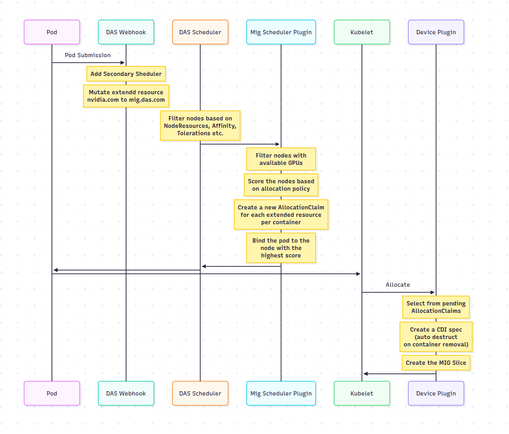

# Dynamic Accelerator Slicer (DAS) Operator

Dynamic Accelerator Slicer (DAS) is an operator that dynamically partitions GPU accelerators in Kubernetes and
OpenShift. It currently ships with a reference implementation for NVIDIA Multi-Instance GPU (MIG) and is designed to
support additional technologies such as NVIDIA MPS or GPUs from other vendors.

## Table of Contents

- [Dynamic Accelerator Slicer (DAS) Operator](#dynamic-accelerator-slicer-das-operator)
  - [Table of Contents](#table-of-contents)
  - [Features](#features)
  - [Getting Started](#getting-started)
    - [Quick Start](#quick-start)
    - [OpenShift with GPU Hardware](#openshift-with-gpu-hardware)
    - [Development Workflow](#development-workflow)
    - [Operator Bundle Development](#operator-bundle-development)
      - [Using a base CSV for bundle generation](#using-a-base-csv-for-bundle-generation)
    - [Emulated Mode](#emulated-mode)
  - [Justfile Usage](#justfile-usage)
    - [Prerequisites](#prerequisites)
    - [Available Commands](#available-commands)
    - [Development and Testing](#development-and-testing)
    - [Bundle Operations](#bundle-operations)
    - [NVIDIA GPU Operator Management](#nvidia-gpu-operator-management)
    - [Cert Manager Operations](#cert-manager-operations)
    - [Node Feature Discovery](#node-feature-discovery)
    - [Code Quality](#code-quality)
    - [Cleanup](#cleanup)
    - [Building and Pushing Images](#building-and-pushing-images)
    - [Deployment](#deployment)
    - [Use custom developer images](#use-custom-developer-images)
    - [Configuration](#configuration)
  - [Architecture](#architecture)
    - [MIG scheduler plugin](#mig-scheduler-plugin)
    - [AllocationClaim resource](#allocationclaim-resource)
  - [Debugging](#debugging)
  - [Running Tests](#running-tests)
    - [Unit Tests](#unit-tests)
    - [End-to-End Tests](#end-to-end-tests)
  - [Uninstalling](#uninstalling)
  - [Contributing](#contributing)
  - [License](#license)

## Features

- On-demand partitioning of GPUs via a custom Kubernetes operator.
- Scheduler integration that allocates NVIDIA MIG slices through a plugin located at
  [`pkg/scheduler/plugins/mig/mig.go`](pkg/scheduler/plugins/mig/mig.go).
- `AllocationClaim` custom resource to track slice reservations
  (`pkg/apis/dasoperator/v1alpha1/allocation_types.go`).
- Emulated mode to exercise the workflow without real hardware.

## Getting Started

This project uses [just](https://github.com/casey/just) for task automation.
Install just first:

```bash
# On macOS
brew install just

# On Fedora/RHEL
dnf install just

# On Ubuntu/Debian
apt install just

# Or via cargo
cargo install just
```

### Quick Start

1. **Configure your images** by editing `related_images.your-username.json` with your registry:

   ```json
   [
     {"name": "instaslice-operator-next", "image": "quay.io/your-username/instaslice-operator:latest"},
     {"name": "instaslice-webhook-next", "image": "quay.io/your-username/instaslice-webhook:latest"},
     {"name": "instaslice-scheduler-next", "image": "quay.io/your-username/instaslice-scheduler:latest"},
     {"name": "instaslice-daemonset-next", "image": "quay.io/your-username/instaslice-daemonset:latest"}
   ]
   ```

2. **Build and push all images**:

   ```bash
   just build-push-parallel
   ```

3. **Deploy to OpenShift** (with emulated mode for development):

   ```bash
   export EMULATED_MODE=enabled
   export RELATED_IMAGES=related_images.your-username.json
   just deploy-das-ocp
   ```

4. **Test the installation**:

   ```bash
   kubectl apply -f test/test-pod-emulated.yaml
   ```

### OpenShift with GPU Hardware

For OpenShift clusters with GPU hardware:

1. **Deploy prerequisites**:

   ```bash
   just deploy-cert-manager-ocp
   just deploy-nfd-ocp
   just deploy-nvidia-ocp
   ```

2. **Deploy DAS operator**:

   ```bash
   export EMULATED_MODE=disabled
   export RELATED_IMAGES=related_images.your-username.json
   just deploy-das-ocp
   ```

3. **Test with GPU workload**:

   ```bash
   kubectl apply -f test/test-pod.yaml
   ```

### Development Workflow

For local development:

1. **Run operator locally** (requires scheduler, webhook, and daemonset images to be built and pushed beforehand):

   ```bash
   # Build and push images first
   just build-push-parallel

   # Run operator locally
   # Set EMULATED_MODE to control hardware emulation
   EMULATED_MODE=enabled just run-local
   ```

2. **Run tests**:

   ```bash
   just test-e2e
   ```

3. **Check code quality**:

   ```bash
   just lint
   ```

### Operator Bundle Development

1. Login into podman and have a repository created for the operator bundle.
2. Set `BUNDLE_IMAGE` to point to your repository and tag of choice.
3. Run `just bundle-generate` to generate the bundle manifests.
4. Run `just build-push-bundle` to build and push the bundle image to your repository.
5. Run `just deploy-cert-manager-ocp` to install cert-manager on OpenShift.
6. Run `operator-sdk run bundle --namespace <namespace> ${BUNDLE_IMAGE}` to deploy
   the operator.

#### Using a base CSV for bundle generation

Running `generate bundle` is the first step to publishing an operator to a catalog
and deploying it with OLM. A CSV manifest is generated by collecting data from the
set of manifests passed to this command, such as CRDs, RBAC, etc., and applying
that data to a "base" CSV manifest.
The steps to provide a base CSV:

- create a base CSV file that contains the desired metadata, the base CSV file name can be arbitrary, we can follow
  the convention `{operator-name}.base.clusterserviceverison.yaml`
- put the base CSV file in the `deploy` folder. This is the folder from which the `generate bundle` command will
  collect the k8s manifests. Note that the base CSV file can be placed inside a sub-directory within the `deploy`
  folder.
- make sure that the `metadata.name` of the base CSV is the same name as the package name provided to the
  `generate bundle` command, otherwise the `generate bundle` command will ignore the base CSV and will generate on an
  empty CSV.

Layout of an example `deploy` folder:

```bash
tree deploy/
  deploy/
  ├── crds
  │   └── foo-operator.crd.yaml
  ├── base-csv
  │   └── foo-operator.base.clusterserviceversion.yaml
  ├── deployment.yaml
  ├── role.yaml
  ├── role_binding.yaml
  ├── service_account.yaml
  └── webhooks.yaml
```

The bundle generation command:

```bash
operator-sdk generate bundle --input-dir deploy --version 0.1.0 --output-dir=bundle --package foo-operator
```

The base CSV yaml:

```yaml
apiVersion: operators.coreos.com/v1alpha1
kind: ClusterServiceVersion
metadata:
  name: foo-operator.base
  annotations:
    alm-examples:
    # other annotations can be placed here
spec:
  displayName: Instaslice
  version: 0.0.2
  apiservicedefinitions:
  customresourcedefinitions:
  install:
  installModes:
  - supported: false
    type: OwnNamespace
  - supported: false
    type: SingleNamespace
  - supported: false
    type: MultiNamespace
  - supported: true
    type: AllNamespaces
  maturity: alpha
  minKubeVersion: 1.16.0
  provider:
    name: Codeflare
    url: https://github.com/openshift/instaslice-operator
  relatedImages:
  keywords:
  - Foo
  links:
  - name: My Operator
    url: https://github.com/foo/bar
  maintainers:
  description:
  icon:
```

- There is no need to provide any permission, or deployment spec inside the base CSV.
- Note that the `metadata.name` of the base CSV has a prefix of `foo-operator.` which adheres to the format
  `{package name}.`
- if there are multiple CSV files inside the deploy folder, the one encountered first in lexical order will be
  selected as the base CSV

The CSV generation details can be found by inspecting the bundle generation code here:
<https://github.com/operator-framework/operator-sdk/blob/0eefc52889ff3dfe4af406038709e6c5ba7398e5/internal/generate/clusterserviceversion/clusterserviceversion.go#L148-L159>

### Emulated Mode

When `emulatedMode` is enabled in the `DASOperator` custom resource, the operator publishes synthetic GPU capacity
and skips NVML calls. This is handy for development and CI environments with no hardware. Set `EMULATED_MODE=enabled`
when using justfile commands to enable this mode.

## Justfile Usage

This project includes a [Justfile](https://github.com/casey/just) for convenient task automation. The Justfile
provides several commands for building, pushing, and deploying the operator components.

### Prerequisites

Install [just](https://github.com/casey/just) command runner:

```bash
# On macOS
brew install just

# On Fedora/RHEL
dnf install just

# On Ubuntu/Debian
apt install just

# Or via cargo
cargo install just
```

### Available Commands

List all available commands:

```bash
just
```

View current configuration:

```bash
just info
```

### Development and Testing

Run the operator locally for development:

```bash
# Set EMULATED_MODE to 'enabled' for simulated GPUs or 'disabled' for real hardware
EMULATED_MODE=enabled just run-local
```

Run end-to-end tests:

```bash
just test-e2e
```

Run tests with a specific focus:

```bash
just test-e2e focus="GPU slices"
```

### Bundle Operations

Generate operator bundle:

```bash
just bundle-generate
```

Build and push bundle image:

```bash
just build-push-bundle
```

Build and push developer bundle:

```bash
just build-push-developer-bundle
```

### NVIDIA GPU Operator Management

Deploy NVIDIA GPU operator to OpenShift:

```bash
just deploy-nvidia-ocp
```

Remove NVIDIA GPU operator from OpenShift:

```bash
just undeploy-nvidia-ocp
```

### Cert Manager Operations

Deploy cert-manager for OpenShift:

```bash
just deploy-cert-manager-ocp
```

Remove cert-manager from OpenShift:

```bash
just undeploy-cert-manager-ocp
```

Deploy cert-manager for Kubernetes:

```bash
just deploy-cert-manager
```

### Node Feature Discovery

Deploy Node Feature Discovery (NFD) operator for OpenShift:

```bash
just deploy-nfd-ocp
```

### Code Quality

Run all linting (markdown and Go):

```bash
just lint
```

Run all linting with automatic fixes:

```bash
just lint-fix
```

Run only Go linting:

```bash
just lint-go
```

Run only markdown linting:

```bash
just lint-md
```

Run Go linting and automatically fix issues:

```bash
just lint-go-fix
```

Run markdown linting and automatically fix issues:

```bash
just lint-md-fix
```

### Cleanup

Clean up all deployed Kubernetes resources:

```bash
just undeploy
```

### Building and Pushing Images

Build and push individual component images:

```bash
just build-push-scheduler   # Build and push scheduler image
just build-push-daemonset   # Build and push daemonset image
just build-push-operator    # Build and push operator image
just build-push-webhook     # Build and push webhook image
```

Build and push all images in parallel:

```bash
just build-push-parallel
```

### Deployment

Deploy DAS on OpenShift Container Platform:

```bash
just deploy-das-ocp
```

Generate CRDs and clients:

```bash
just regen-crd           # Generate CRDs into manifests directory
just regen-crd-k8s       # Generate CRDs directly into deploy directory
just generate-clients    # Generate client code
just verify-codegen      # Verify generated client code is up to date
just generate            # Generate all - CRDs and clients
```

### Use custom developer images

Copy related_images.developer.json to related_images.username.json to use as a template and modify it to contain
the target developer image repositories to use.

```sh
cp related_images.developer.json related_images.username.json
# Edit related_images.username.json with your registry
quay.io/username/image:latest
```

Then set the RELATED_IMAGES environment variable to related_images.username.json.

```sh
RELATED_IMAGES=related_images.username.json just
```

### Configuration

The Justfile uses environment variables for configuration. You can customize these by setting them in your
environment or creating a `.env` file:

- `PODMAN` - Container runtime (default: `podman`)
- `KUBECTL` - Kubernetes CLI (default: `oc`)
- `EMULATED_MODE` - Enable emulated mode (default: `disabled`)
- `RELATED_IMAGES` - Path to related images JSON file (default: `related_images.json`)
- `DEPLOY_DIR` - Deployment directory (default: `deploy`)
- `OPERATOR_SDK` - Operator SDK binary (default: `operator-sdk`)
- `OPERATOR_VERSION` - Operator version for bundle generation (default: `0.1.0`)
- `GOLANGCI_LINT` - Golangci-lint binary (default: `golangci-lint`)

Example:

```bash
export EMULATED_MODE=enabled
just deploy-das-ocp
```

## Architecture

The diagram below summarizes how the operator components interact. Pods requesting GPU slices are mutated by a
webhook to use the `mig.das.com` extended resource. The scheduler plugin tracks slice availability and creates
`AllocationClaim` objects processed by the device plugin on each node.



### MIG scheduler plugin

The plugin integrates with the Kubernetes scheduler and runs through three framework phases:

- **Filter** – ensures the node is MIG capable and stages `AllocationClaim`s for suitable GPUs.
- **Score** – prefers nodes with the most free MIG slice slots after considering existing and staged claims.
- **PreBind** – promotes staged claims on the selected node to `created` and removes the rest.

Once promoted, the device plugin provisions the slices.

### AllocationClaim resource

`AllocationClaim` is a namespaced CRD that records which MIG slice will be prepared for a pod. Claims start in the
`staged` state and transition to `created` once all requests are satisfied. Each claim stores the GPU UUID, slice
position and pod reference.

Example:

```console
$ kubectl get allocationclaims -n das-operator
NAME                                          AGE
8835132e-8a7a-4766-a78f-0cb853d165a2-busy-0   61s
```

```console
$ kubectl get allocationclaims -n das-operator -o yaml
apiVersion: inference.redhat.com/v1alpha1
kind: AllocationClaim
...
```

## Debugging

All components run in the `das-operator` namespace:

```console
kubectl get pods -n das-operator
```

Inspect the active claims:

```console
kubectl get allocationclaims -n das-operator
```

On the node, verify that the CDI devices were created:

```console
ls -l /var/run/cdi/
```

Increase verbosity by editing the `DASOperator` resource and setting `operatorLogLevel` to `Debug` or `Trace`.

## Running Tests

### Unit Tests

Run all unit tests for the project:

```bash
make test
```

Run unit tests with verbose output:

```bash
go test -v ./pkg/...
```

Run unit tests with coverage:

```bash
go test -cover ./pkg/...
```

### End-to-End Tests

A running cluster with a valid `KUBECONFIG` is required:

```bash
just test-e2e
```

You can focus on specific tests:

```bash
just test-e2e focus="GPU slices"
```

## Uninstalling

Remove the deployed resources with:

```bash
just undeploy
```

## Contributing

Contributions are welcome! Please open issues or pull requests.

## License

This project is licensed under the Apache 2.0 License.
