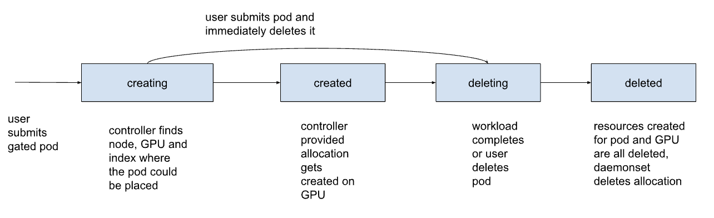
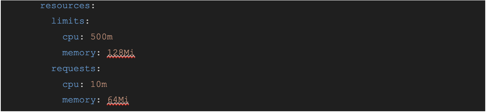
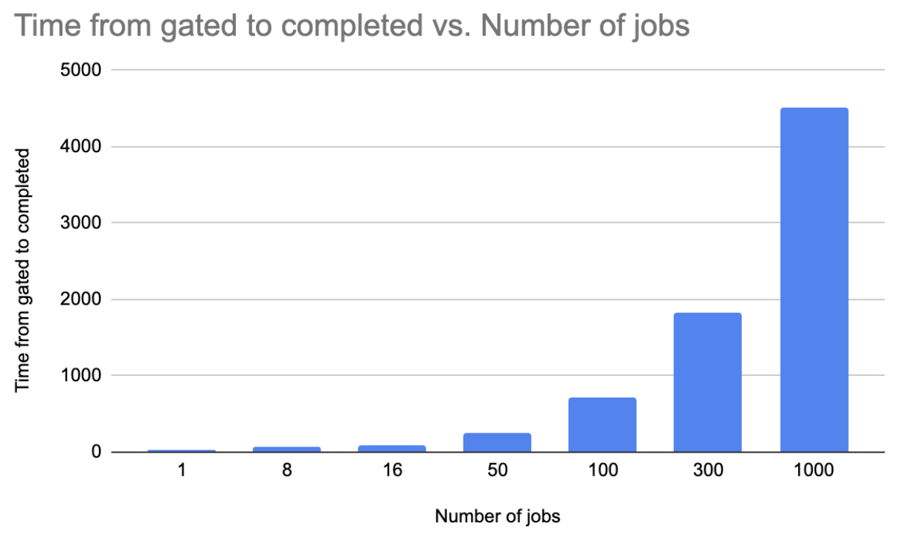

# Design of InstaSlice and performance analysis:

Below documentation illustrates current implementation the system. InstaSlice introduced states so that the controller can operate on pods and InstaSlice objects and daemonset will only operate on a single InstaSlice object. This was done for separations of concerns and also if InstaSlice later becomes scheduler plugin the porting of code is much easier in theory.

## States for InstaSlice allocation status:

InstaSlice has two controllers (restating):
- Controller reconciles on pods and watches/updates InstaSlice objects.
- Daemonset reconciles on InstaSlice objects.

InstaSlice allocation states per pod:
- creating : the controller finds a allocation for pod and makes a “soft” allocation
- created : the daemonset creates:
    - Actual allocation on the GPU,
    - Adds pod annotation with MIG UUID
    - InstaSlice resource and
    - Updates node capacity
- ungated : the controller ungates the pod when the slice exists and scheduler takes over
- deleting : the controller sets status as deleting when user deletes pods or the pod completes
- deleted : the daemonset state set status to deleted and deletes
    - Ci and Gi
    - InstaSlice resource and
    - Updates node capacity

Allocations and prepared sections are added to the same InstaSlice object for every gated pod in the system. Allocation object  state can be mutated by the controller and daemonset. The prepared section is added and deleted by the daemonset.

# Scalability envelop:

- Experiment setup:

Single threaded load script submits gate pods with the system with a unique name and periodically wakes up every 30 seconds to check pod completed status. The experiment was run for 1, 8 , 50, 100, 1000 and 3000 pods.The system starts executing as soon as a pod enters in the system. Resources are released as the pod completes. The system is re-deployed for every experiment.
The SUT has been tested under batch assumption with short tasks. I am not sure if users will create short tasks that are 3 sec long to create new slices on the fly.

- Hardware setup:

The node has two A100s with 40 GB of GPU memory, 72 online CPUs hyperthreaded and 1 TB of ram.
We have 3g.20gb dangling slices on the GPUs, these are not used by the controller. Once we have the upstream GPU operator fix deployment instructions, we can start using a clean slate GPU for making allocations.

- KinD:

We used the KinD cluster to run experiments for version please check the README of instaslice repo here: https://github.com/openshift/instaslice-operator

- System throughput:

The throughput of the system will be limited by the amount of slices available and how fast the controller reacts to pod completions.

- Workload:

We use  cuda-vector-add, which is a short workload and completes in about 3 seconds. not sure if this workload is representative of actual inference workload but is a good candidate to stress the system.

- Resources consumed by controller and daemonset:

Time from gate to completion is the time when pod phase changes to Succeeded from SchedulingGated. It is the end-to-end wall clock time of the pods queued by gating, pod pulling image (may not exist as the system already has the image cached), container creation and execution of cuda vector add.
Time from gate to completion includes the script overhead of waking up every 30 seconds and iterating through all pods to check the completed status.
